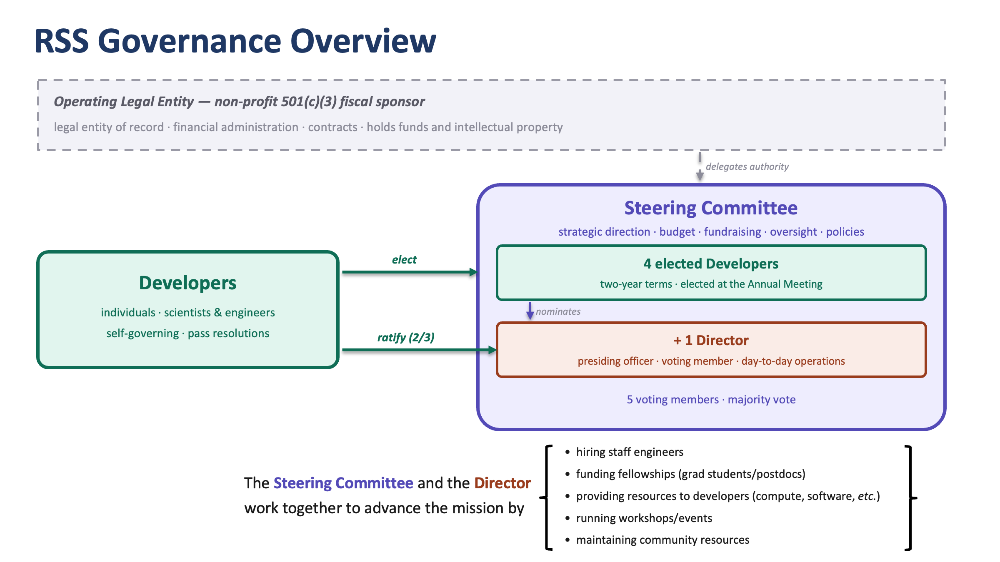

# CHARTER OF THE RECIPROCAL SPACE STATION 
Status: working draft

## Mission
The Reciprocal Space Station (“RSS”, the “Organization”) is an academic organization tasked with creating open-source software to advance the science of structural biology. The field of structural biology has historically succeeded by resolving static molecular structures; RSS exists to sustain this capability and extend it to the modeling of conformational distributions, molecular dynamics, and biological context.

The Organization serves two primary constituencies: researchers in academia and industry who seek to extract biological and medical insight from complex structural data, and the community of software developers and methods researchers who build upon and extend structural biology tooling.

All software produced by the Organization shall be released under permissive open-source licenses and developed to standards of engineering excellence, including automation, performance, and documentation. These are first-order concerns of the Organization alongside scientific rigor.

To advance its mission, the Organization may undertake education, knowledge curation, benchmarking, interoperability, workshops, training, and community-building activities within structural biology.

## Visual Summary

